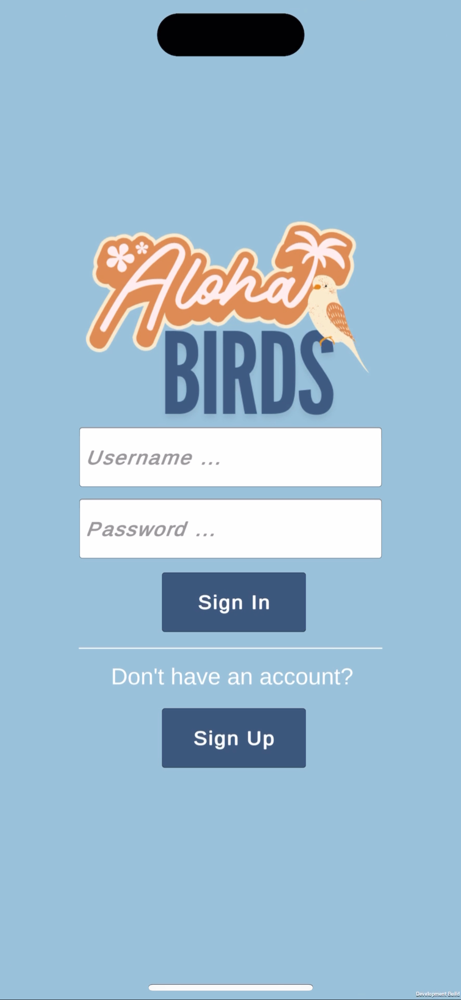
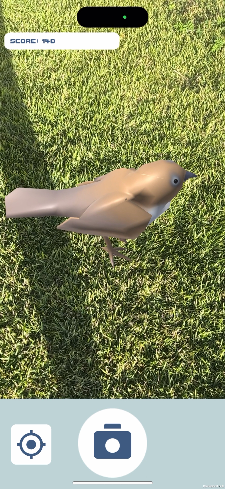
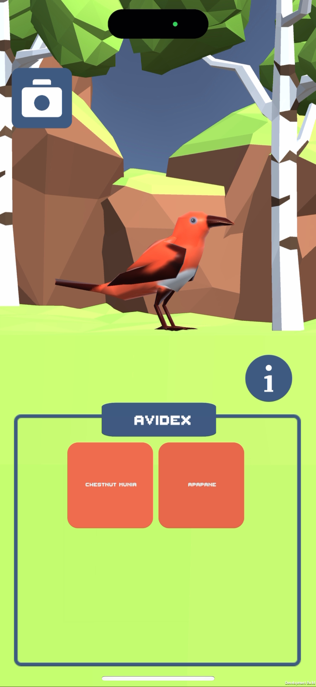
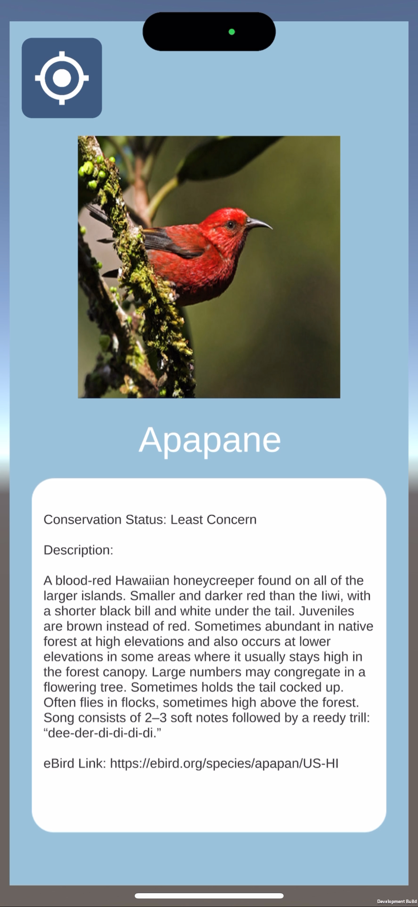

# Overview
With climate change and habitat loss, nearly half of Native Hawaiian bird species are now extinct, and many people are unaware of the significance of these endangered species. To bridge this gap, AlohaBirds is a mobile AR game designed to educate users about Hawaii's native birds in an engaging way. Similar to Pokémon GO, the app encourages users to explore different areas of the island to discover 3D models of native bird species.

AlohaBirds raises awareness of endangered Hawaiian birds by guiding users to find and learn about different species through GPS-based augmented reality. As users move around the island, specific birds appear within a 3-feet radius, and players can take photos of them for points. Once captured on camera, the bird is added to the user's "AviDex," where they can closely inspect the 3D model and access detailed species information.

# Tech Stack
- Unity
- OpenXR (AR in Unity)
- Blender (For 3D models)
- Free 3D models was downloaded from Unity's Asset Store. The assets used can be found under the Plugins folder. 

# Judging
Please contact malisalo@hawaii.edu to see app or to schedule a call tech review. This app was only developed for iOS. Camera and Location on phone is needed for app.

# Screenshots

## Login

## Camera View

## Avidex

## Bird Info

  
